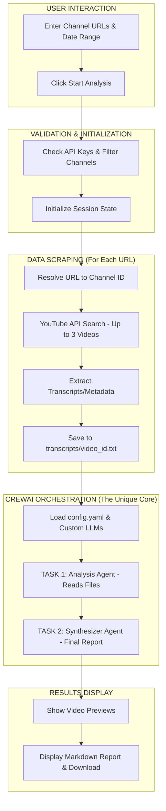

# -CrewAI-MultiAgent-YouTube-Trend-Analyzer-OpenRouter-
The YouTube Trend Analysis Agent is a CrewAI-based multi-agent system that automates YouTube market intelligence . It uses a vendor-agnostic architecture powered by OpenRouter, allowing dynamic switching between LLMs at low or zero cost by injecting custom model paths and headers through a configurable LLM class instead of hardcoding providers.

This tool is built for creators and researchers who need a practical way to sift through YouTube noise without manually watching hours of footage. Instead of complex, "enterprise-grade" promises, this project offers a straightforward solution: a team of AI agents that work together to grab video transcripts and find the patterns you actually care about. By using OpenRouter as the "brain," you aren't stuck paying for expensive OpenAI credits; you can switch to free or cheaper models with one line of text. It's a low-code, hands-on way to automate your research using CrewAI agents that act as your personal research assistants, delivering clean Markdown reports directly to your dashboard.

🛠️ The OpenRouter + CrewAI Setup
We use OpenRouter as a sleek method to bypass credit tiers of paid models. This allows us to use a single API key to access hundreds of models (like Claude, GPT-4o, or Gemini) just by changing a model name.

How to implement custom agents: Instead of the default settings, we initialize a custom LLM object. This tells CrewAI to "talk" to OpenRouter instead of going straight to OpenAI.

Python Implementation

from crewai import LLM, Agent

# Setup OpenRouter as your custom LLM
my_llm = LLM(
    model="openrouter/google/gemini-2.0-flash:free", # Pick any model from OpenRouter
    base_url="https://openrouter.ai/api/v1",
    api_key="your_openrouter_key"
)

# Assign it to your agent
researcher = Agent(
    role="Trend Scout",
    goal="Find 3 recurring themes in these transcripts",
    backstory="You're a helper who summarizes videos quickly.",
    llm=my_llm  # This makes the agent use OpenRouter
)
By doing this, we gain the freedom to test different "brains" for your agents without rewriting your code. You can use a heavy-duty model for deep analysis and a lighter, free model for the final summary to save money.
## 🏗️ Project Architecture

